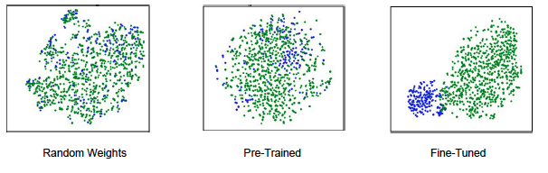

# Naive Bees Classifier - 1st Place
   
# Entrant Background and Submission Overview

### High Level Summary of Submission
We obtained an AUC of 0.9956 (almost perfect separation) using convolutional
neural networks.  Since pre-trained networks were allowed, we moved forward towards fine tuning some pre-trained networks.  We fine-tuned a GoogleNet model using caffe and achieved great results. Fine-tuning using caffe is an easy task.  For each of the inception outputs in GoogleNet, we extracted the features and passed it through logistic regression model.

We also generated tSNE projections of the 1024-dimensional output from the final pooling layer. This provides a visual indicator of how well the network can separate the classes. As expected, a randomly initialized network produces no separation. The pre-trained network displays some clustering, but it is not well separated, while the fine-tuned network produces two nearly distinct clusters as shown below.

Finally, a blend of 3 fine-tuned GoogleNet model gave an AUC of 0.9951 on public leaderboard and 0.9956 on private leaderboard.

### Model Evaluation
We used area under the ROC Curve.

  
# Replicating the Submission

### Create training file list
* create_training_dataset.py

### Run caffe
* put bvlc_googlenet.caffemodel in ./

* `./PATH_TO_CAFFE/caffe train -solver ./solver.prototxt -weights ./bvlc_googlenet.caffemodel`

* snapshots are saved every 1000 iterations to ./snapshots/

Caffe must be run upto 20000 iterations.

### Create test predictions
* `create_preds.py`

### Make final predictions
* `create_sub.py`
